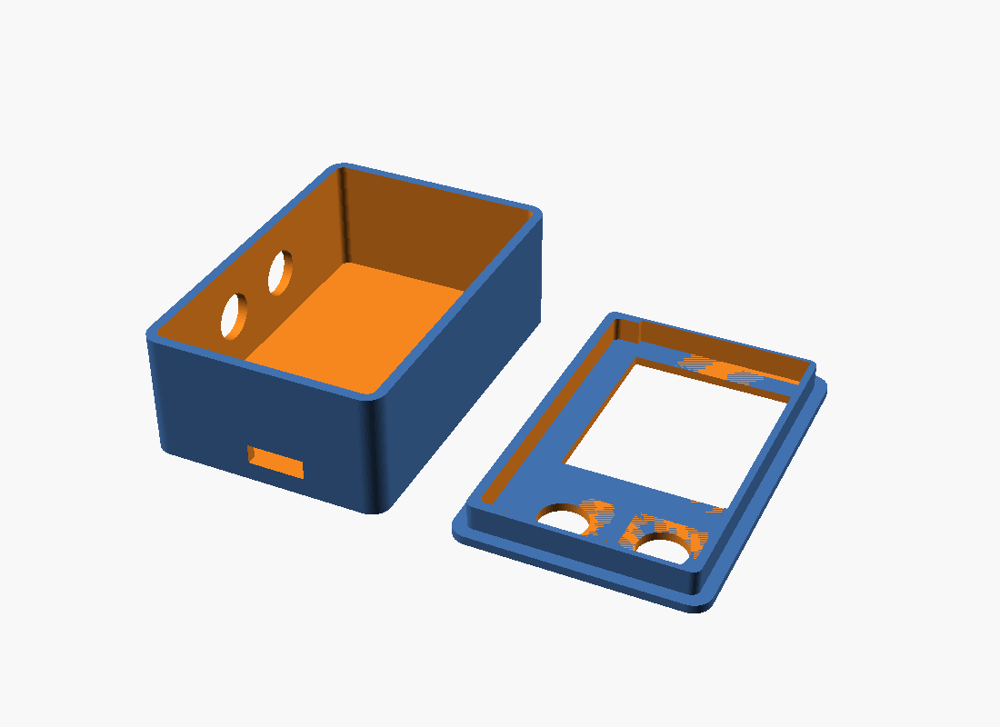

# Enclosure — 3D printed case

A custom two-part handheld case for the Claude Code Remote, sized to an ESP32
(52×28, USB-C) with a 1.3" ST7789 bolted on top (~17 mm stack). **~39 × 58 × 21 mm.**

| File | Print | Notes |
|------|-------|-------|
| `base.stl` | 1× | Tray for the ESP32+screen stack. USB-C cutout on the bottom end; 2 cap holes on the left wall for the scroll buttons. |
| `lid.stl` | 1× | Front plate: screen window + the 2 action-button cap holes below it. Print **face-down**. |
| `claude-code-remote-case.scad` | — | Parametric source — every dimension is at the top. |



## Layout

- **Screen** centered up top behind the lid window (1.4 mm bezel).
- **Action buttons (✓ ✗)** — two 7.6 mm cap holes on the lid, below the screen.
- **Scroll buttons (▲ ▼)** — two 7.6 mm cap holes on the **left wall**; the
  12×12×3 mm switches stand on edge in the left channel, caps facing out.
- No screws — **base and lid glue/tape together**; the side switches glue into
  the channel.

## Print settings

PLA or PETG · 0.2 mm layers · 4 perimeters (walls are 1.6 mm) · 20% infill ·
**no supports** (print the lid face-down).

## Customizing

Open `claude-code-remote-case.scad`, edit the `CONFIG` block (board size, stack
height, screen window, button positions, channel width, wall thickness), then:

```bash
openscad -o base.stl -D pn=1 claude-code-remote-case.scad
openscad -o lid.stl  -D pn=2 claude-code-remote-case.scad
```

See [`../../docs/BUILD.md`](../../docs/BUILD.md) for the full build.
